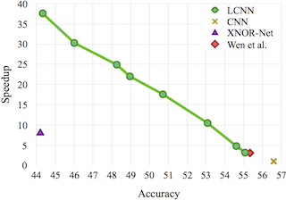

## LCNN: *Lookup-based Convolutional Neural Network*
By [Hessam Bagherinezhad](http://homes.cs.washington.edu/~hessam/), [Mohammad Rastegari](http://www.umiacs.umd.edu/~mrastega/), and [Ali Farhadi](http://homes.cs.washington.edu/~ali/)

### Introduction

LCNN is a fast, compact, yet accurate model for convolutional neural networks that enables efficient inference and training. Training LCNN involves jointly learning a dictionary of vectors and a small set of linear combinations. LCNN *is not* a model architecture, but you can convert any CNN architecture to LCNN by replacing all the convolutional and dense layers to lookup-based layers. AlexNet LCNN, for example, can offer 37.6x speedup while maintaining 44.3% top-1 ImageNet accuracy, or it can acheive 55.1% top-1 ImageNet accuracy while giving 3.2x speedup.

LCNN appeared in CVPR 2017.
### Citing LCNN

If you find LCNN useful in your research, please consider citing:

    @inproceedings{bagherinezhad2017lcnn,
        title={LCNN: Lookup-based Convolutional Neural Network},
        author={Bagherinezhad, Hessam and Rastegari, Mohammad and Farhadi, Ali},
        booktitle={Proceedings of the IEEE Conference on Computer Vision and Pattern Recognition},
        year={2017}
    }

### Inference efficiency results

Any CNN architecture can be converted to LCNN, by replacing the convolutional and dense layers to look-up based ones. Depending on the size of the dictionary and sparsity parameters, it can offer different speedup and accuracy.

AlexNet        | speedup    | top-1% | top-5%
-------------- |:----------:|:------:|:-------:
CNN            | 1.0x       | 56.6%  | 80.2%
LCNN-fast      | 37.6x      | 44.3%  | 68.7%
LCNN-accurate  | 3.2x       | 55.1%  | 78.1%

In fact, by setting the hyper parameters of LCNN (dictionary size, and sparsity factor) we can trace a spectrum of speedup.



ResNet-18      | speedup    | top-1% | top-5%
-------------- |:----------:|:------:|:-------:
CNN            | 1.0x       | 69.3%  | 90.0%
LCNN-fast      | 29.2x      | 51.8%  | 76.8%
LCNN-accurate  | 5.0x       | 62.2%  | 84.6%

### Training efficiency results
We emperically showed that LCNN can offer accuracy improvements over CNN when few examples are provided. Please refer to [our paper](https://homes.cs.washington.edu/~hessam/uploads/files/LCNN.pdf), Sections 4.3 and 4.4, for the discussion and settings of our experiments.

### Install LCNN
This source code only contains the training code of LCNN, and *does not* contain the fast inference code. With this source code, you can train LCNN models and count the number of `FLOP`s.

##### Requirements
This source code is based on [torch's sample code for multi-gpu programming](https://github.com/soumith/imagenet-multiGPU.torch). The package requirements are all the same:
- [Install torch on a machine with CUDA GPU](http://torch.ch/docs/getting-started.html#_)
- If on Mac OSX, run `brew install coreutils findutils` to get GNU versions of `wc`, `find`, and `cut`

These requirements are needed for training/testing on ImageNet:
- Download [Imagenet-12 dataset](http://image-net.org/download-images).
- Download our [dataset metadata files](https://storage.googleapis.com/xnorai-public/downloads/LCNN/cache.tar.gz) (the list of images, label ordering, mean and stdv, etc.), put under projects' root directory, and extract by `tar xvf cache.tar.gz`.

##### Training
Training can be done with the following command:
```
th main.lua -data /path/to/imagenet -netType NETWORK
```

`NETWORK` may be one of `alexnet`, `alexnet-lcnn`, `resnet`, or `resnet-lcnn`. Default is to `alexnet-lcnn`.

For `alexnet-lcnn`, you may control the dictionary size by `-poolSize`, `-firstPool`, `-fcPool` and `-classifierPool`. For `resnet-lcnn`, you may control the dictionary size of different blocks by `-pool1`, `-pool2`, `-pool3`, `-pool4`, and `-firstPool`. Make sure to set `-lambda` to get sparsity in the tensor `P` (and therefore few look-ups).

For training ResNet, you need to set `-batchSize 256`. If it doesn't fit into your GPU memory, use `-breakBatch` flag to break a batch into smaller pieces.

##### Testing
Testing the accuracy of a model on ImageNet's validation set can be done with the following command:
```
th main.lua -data /path/to/imagenet -netType NETWORK -testOnly -retrain /path/to/trained/model.t7
```
We provide the models for [AlexNet LCNN fast](https://storage.googleapis.com/xnorai-public/downloads/LCNN/alexnet-lcnn-fast.t7) and [AlexNet LCNN accurate](https://storage.googleapis.com/xnorai-public/downloads/LCNN/alexnet-lcnn-accurate.t7), which are in the paper's table. They should get `44.3%` and `55.1%` top-1 accuracies respectively.

##### Counting FLOPs
Counting the number of FLOPs of a model can be done with the following command:
```
th main.lua -data /path/to/imagenet -netType NETWORK -benchmark -retrain /path/to/trained/model.t7
```
This will print the number of operations (multiplications) for each layer and exits. Please note that in order to count the number of operations of a CNN model, you don't need to provide `-retrain /path/to/trained/model.t7` because training doesn't change the number of FLOPs. In LCNN, however, because the number of lookups decreases over training, a trained model needs to be passed to get meaningful results.

### License
By downloading this Software you acknowledge that you read and agreed all the terms in the `LICENSE` file.
